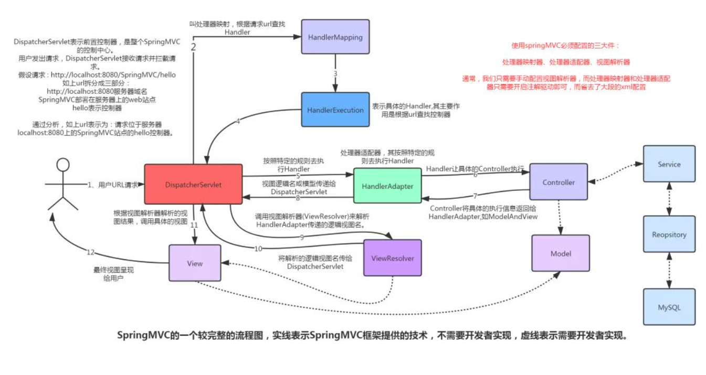

# Spring Web MVC
## Spring MVC 的核心组件

- DispatcherServlet：前置控制器，是整个流程控制的核心，控制其他组件的执行，进行统一调度，降低组件之间的耦合性，相当于总指挥。
- Handler：处理器，完成具体的业务逻辑，相当于 Servlet 或 Action。
- HandlerMapping：DispatcherServlet 接收到请求之后，通过 HandlerMapping 将不同的请求映射到不同的 Handler。
- HandlerInterceptor：处理器拦截器，是一个接口，如果需要完成一些拦截处理，可以实现该接口。
- HandlerExecutionChain：处理器执行链，包括两部分内容：Handler 和 HandlerInterceptor（系统会有一个默认的 HandlerInterceptor，如果需要额外设置拦截，可以添加拦截器）。
- HandlerAdapter：处理器适配器，Handler 执行业务方法之前，需要进行一系列的操作，包括表单数据的验证、数据类型的转换、将表单数据封装到 JavaBean 等，这些操作都是由 HandlerApater 来完成，开发者只需将注意力集中业务逻辑的处理上，DispatcherServlet 通过 HandlerAdapter 执行不同的 Handler。
- ModelAndView：装载了模型数据和视图信息，作为 Handler 的处理结果，返回给 DispatcherServlet。
- ViewResolver：视图解析器，DispatcheServlet 通过它将逻辑视图解析为物理视图，最终将渲染结果响应给客户端。

## 工作流程
1. DispatcherServlet 表示前置控制器，是整个SpringMVC的控制中心。用户发出请求，接收请求并拦截请求。
2. HandlerMapping 为处理器映射。DispatcherServlet调用 HandlerMapping，HandlerMapping根据请求url查找Handler
3. HandlerExecution 表示具体的Handler,其主要作用是根据url查找控制器，如上url被查找控制器为：hello。HandlerExecution 将解析后的信息传递给 DispatcherServlet，如解析控制器映射等。
4. HandlerAdapter 表示处理器适配器，其按照特定的规则去执行Handler。
5. Handler 让具体的 Controller 执行。
6. Controller 将具体的执行信息返回给 HandlerAdapter,如ModelAndView。
7. HandlerAdapter将视图逻辑名或模型传递给 DispatcherServlet。
8. DispatcherServlet 调用视图解析器(ViewResolver)来解析 HandlerAdapter 传递的逻辑视图名。
9. 视图解析器将解析的逻辑视图名传给 DispatcherServlet。
10. DispatcherServlet 根据视图解析器解析的视图结果，调用具体的视图。
11. 最终视图呈现给用户。

> 参考连接：
>
> https://cloud.tencent.com/developer/article/1775687